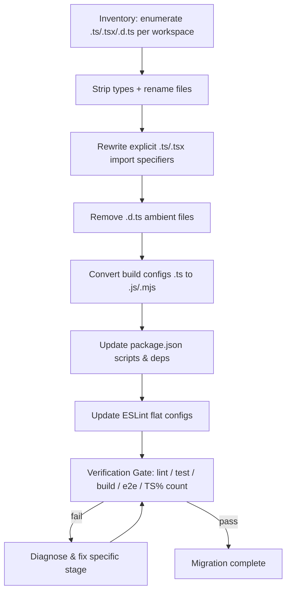

# Design Document

## Overview

This design describes how to migrate the `ai-job-copilot` monorepo from TypeScript to plain JavaScript (and JSX) while preserving all runtime behavior, tests, builds, and deployment. The goal is to reduce the repository's GitHub Linguist TypeScript classification to strictly less than 1%, which in practice means converting every first-party `.ts`/`.tsx` file, removing all `.d.ts` files, and eliminating TypeScript build tooling.

The migration touches 67 first-party source files (56 `.ts`, 11 `.tsx`) across five workspaces (`client`, `server`, `shared`, `extension`, `e2e`), plus build/test/lint configuration and package manifests.

### Key grounding facts (discovered from the codebase)

These facts drive the entire strategy and substantially de-risk it:

1. **Everything is already ESM.** Every workspace `package.json` declares `"type": "module"` and every `tsconfig.json` uses `"module": "ESNext"`. There is no CommonJS output anywhere. This means converted `.js` files are ESM by default and run under Node with no module-system translation. The critical "ESM vs CommonJS" decision is therefore already settled — we keep ESM.

2. **Server imports already carry explicit `.js` extensions.** Files like `server/src/app.ts` import `./config/env.js`, `./middleware/requestId.js`, etc. (a requirement of `moduleResolution: Bundler` + Node ESM). After renaming `env.ts` → `env.js`, those specifiers resolve unchanged. No server import rewriting is needed for internal modules.

3. **Client/extension imports are extensionless** (`./App`, `./providers/AuthProvider`). Vite/esbuild resolves these regardless of `.jsx` extension, so no rewriting is needed there either.

4. **The client already enforces `erasableSyntaxOnly: true`.** This TypeScript flag rejects any non-erasable TS construct (enums, namespaces with runtime output, constructor parameter properties). Combined with a repository-wide grep confirming **zero `enum` declarations**, this guarantees all TypeScript in the codebase is *type-only syntax that can be mechanically erased* with no runtime-shape changes.

5. **No path aliases are configured.** No `tsconfig` defines `compilerOptions.paths`, so there are no `@/...` aliases to replicate in Vite or a `jsconfig`.

6. **Only one ambient declaration file exists:** `server/src/types/express.d.ts`. Its augmented properties (`req.requestId`, `req.user`) are already assigned at runtime in `middleware/requestId.ts` and `middleware/auth.ts`, so deleting the file changes no runtime behavior.

Because the TypeScript is purely erasable and the module system is uniform, the migration is a **mechanical type-stripping + file-rename + tooling-cleanup** operation rather than a semantic rewrite.

## Architecture

### Migration pipeline

The pipeline runs per workspace but the Verification Gate runs against the whole repository, because workspaces depend on each other (`client` and `server` consume `@copilot/shared`).

### Type-stripping mechanism

**Chosen tool: [`detype`](https://github.com/cyco130/detype) as the primary transformer, followed by a Prettier normalization pass and manual review.**

Rationale and comparison of candidate mechanisms:

| Mechanism | Strips types | Output quality | Verdict |
|---|---|---|---|
| **`detype`** | Yes (Babel-based) | Re-formats with Prettier; preserves comments; purpose-built for `.ts`→`.js` and `.tsx`→`.jsx`, including extension renaming | **Chosen** — cleanest human-readable output |
| `ts-blank-space` | Yes (blanks type ranges) | Preserves exact layout but leaves whitespace "holes" where types were | Rejected — leaves ragged blank gaps |
| `sucrase` / `esbuild` | Yes | Fast, but reformats aggressively and is designed for build-time transpilation, not source rewriting; can drop comments | Rejected for source, acceptable as a cross-check |
| `@babel/preset-typescript` | Yes | Requires manual Babel wiring; output needs Prettier anyway | Rejected — `detype` wraps this more cleanly |
| `tsc` | Yes | We are *removing* TypeScript; also downlevels syntax and rewrites modules | Rejected — contradicts the goal |

`detype` uses Babel to parse and remove TypeScript-only syntax (type annotations, interfaces, type aliases, generic parameters, `as`/`satisfies` assertions, non-null `!`, `import type`/`export type`, `declare`) and then runs Prettier so the emitted `.js`/`.jsx` reads like hand-written source. Because Babel only *erases* type syntax and never rewrites value-level constructs, runtime behavior is preserved (Requirement 1.4). This is safe precisely because grounding fact #4 guarantees the codebase contains only erasable syntax.

`detype` is used as a build-time/CLI dev tool during migration only; it is **not** added as a project dependency, so it does not affect the shipped codebase or the TypeScript percentage.

**Cross-check:** after conversion, a value-export comparison (see Correctness Properties) and the existing test suites confirm behavior preservation. Where `detype` produces an awkward result for a specific construct (e.g., a complex `satisfies` chain in `openings.discovery.ts`), the file is cleaned up manually and re-run through Prettier.

### Module system decision

**Decision: preserve ESM everywhere.** No `package.json` `"type"` field changes. Converted `.js` files are ESM modules exactly as the `.ts` files were. Node runs the server's `.js` files directly (no compile step). Vite continues to treat client/extension sources as ESM.

## Components and Interfaces

### Component 1: File converter

**Responsibility:** For each first-party `.ts`/`.tsx` source file (excluding `.d.ts`), produce a same-named, same-directory `.js`/`.jsx` file with all type syntax removed and all value-level imports/exports preserved; then delete the original.

**Interface (conceptual):**
- Input: path to a Source_File
- Output: path to the produced JS_File, or a failure record `{ file, reason }` (Requirement 1.8)

**Behavior:**
- `.ts` (non-`.d.ts`) → `.js`
- `.tsx` → `.jsx`
- `.d.ts` → deleted, no output (handled by Component 3)

### Component 2: Import specifier rewriter

**Responsibility:** Rewrite only import/export specifiers that end in an explicit `.ts` or `.tsx` extension to `.js`/`.jsx` (Requirement 3.1), leaving extensionless specifiers untouched (Requirement 3.2).

**Observed scope:** Grounding facts #2 and #3 show the codebase uses either `.js` specifiers (server internal imports, already correct) or extensionless specifiers (client/extension). A grep for `from "..\.tsx?"` is expected to return **zero** first-party matches, so this component is largely a safety net. It still runs to satisfy the requirement and to catch any stray specifier.

### Component 3: Ambient declaration remover

**Responsibility:** Delete every first-party `.d.ts` file (Requirement 2.1). The only such file is `server/src/types/express.d.ts`.

**Interface:** none produced — deletion only, with a check that the runtime assignments it described (`req.requestId` in `requestId.ts`, `req.user` in `auth.ts`) remain present (Requirement 2.2, 2.4).

### Component 4: Build-config converter

**Responsibility:** Convert each `.ts` build config to a JavaScript equivalent with identical resolved values (Requirement 4.2), remove all `tsconfig.json` files (Requirement 4.1), and ensure no `.ts`/`.mts`/`.cts` config remains (Requirement 4.6).

Per-config transforms:

| Config | Action | Notes |
|---|---|---|
| `client/vite.config.ts` | → `vite.config.js` | Drop `import`-level types only; body is plain JS already |
| `client/vitest.config.ts` | → `vitest.config.js` | Change `include: ["src/**/*.test.tsx"]` → `["src/**/*.test.jsx"]` |
| `client/tailwind.config.ts` | → `tailwind.config.js` | Remove `import type { Config }` and `satisfies Config`; change `content` glob `"./src/**/*.{ts,tsx}"` → `"./src/**/*.{js,jsx}"` |
| `server/vitest.config.ts` | → `vitest.config.js` | Change `include: ["src/**/*.test.ts"]` → `["src/**/*.test.js"]` |
| `server/prisma.config.ts` | → `prisma.config.js` | `prisma/config` ships JS; update `seed: "tsx prisma/seed.ts"` → `"node prisma/seed.js"` |
| `extension/vite.config.ts` | → `vite.config.js` | Update rollup inputs `src/content.ts`/`src/background.ts` → `.js` |
| `playwright.config.ts` (root) | → `playwright.config.js` | Body is plain JS already |
| all `tsconfig.json`, `server/tsconfig.eslint.json` | delete | Requirement 4.1 |

`postcss.config.cjs` (client) is already JavaScript and is left unchanged.

### Component 5: Package-manifest updater

**Responsibility:** Update scripts and dependencies per workspace (Requirements 5.1–5.9).

Script transforms:

| Workspace | Script | Before | After |
|---|---|---|---|
| root | `typecheck` + 4 variants | `tsc -p ...` | **removed entirely** (Req 5.4) |
| root | `lint-staged` globs | `*.{ts,tsx,js,jsx,...}`, `server/src/**/*.{ts,tsx}` | `.{js,jsx,...}`, `server/src/**/*.{js,jsx}` (Req 5.6) |
| server | `dev` | `tsx watch src/index.ts` | `node --watch src/index.js` (Req 5.7) |
| server | `build` | `prisma generate && tsc -p tsconfig.json` | `prisma generate` (Req 5.3) |
| server | `start` | `node dist/index.js` | `node src/index.js` |
| server | `lint` | `eslint src prisma --ext .ts` | `eslint src prisma` (flat config selects files; Req 5.5) |
| server | `prisma:seed` + `prisma.seed` | `tsx prisma/seed.ts` | `node prisma/seed.js` (Req 5.7) |
| client | `build` | `tsc && vite build` | `vite build` (Req 5.3) |
| client | `lint` | `eslint src --ext .ts,.tsx` | `eslint src` (Req 5.5) |
| shared | `build` | `tsc -p tsconfig.json` | **removed**; see shared package below |
| shared | `prepare` | `npm run build` | removed |
| shared | `lint` | `eslint src --ext .ts` | `eslint src` |
| extension | `build` | `tsc --noEmit && vite build` | `vite build` (Req 5.3) |

Dependency removals (Requirement 5.1), applied where no longer referenced: `typescript`, `ts-node`, `tsx`, all `@types/*`, both `@typescript-eslint/*` packages. Retained runtime packages that merely ship as JS: `zod`, `@prisma/client`, `@prisma/adapter-pg` (Requirement 5.8). `@eslint/js`, `eslint`, and the React ESLint plugins stay.

### Component 6: `@copilot/shared` package retargeting

`shared/package.json` currently exposes `"main": "dist/index.js"` and `"types": "dist/index.d.ts"` produced by `tsc`. After migration there is no build step. Changes:
- `"main": "src/index.js"` (consume source directly — it is plain ESM JS)
- remove `"types"`
- remove `build` and `prepare` scripts

Consumers (`client`, and any server usage) import the package by name; retargeting `main` keeps resolution working without a compile step.

### Component 7: ESLint flat-config updater

Each workspace uses a flat config importing `@typescript-eslint/parser` and `@typescript-eslint/eslint-plugin`. Transforms (Requirement 4.3):
- Remove `tsParser`/`tseslint` imports, the `parser` and `parserOptions.project` settings, the `@typescript-eslint` plugin entry, and all `@typescript-eslint/*` rules.
- Change `files` globs from `**/*.{ts,tsx}` / `**/*.ts` to `**/*.{js,jsx}` / `**/*.js`.
- Re-enable core `no-unused-vars` (replacing `@typescript-eslint/no-unused-vars`) with the same `argsIgnorePattern: "^_"`.
- Client keeps `eslint-plugin-react-hooks` and `eslint-plugin-react-refresh`; default espree parser handles JSX via `parserOptions: { ecmaFeatures: { jsx: true } }` (or the react plugin's recommended config).

## Data Models

### File rename mapping

The full mapping is `X.ts → X.js` and `X.tsx → X.jsx`, same directory. Representative entries by workspace:

**shared/** (1 file)
- `src/index.ts → src/index.js`

**server/** (source `.ts` → `.js`, `express.d.ts` deleted)
- entries: `src/index.ts`, `src/app.ts`, `src/{ai,auth,jobs}.test.ts`, `src/config/env.ts`, `src/db/prisma.ts`, `src/middleware/{auth,authRateLimit,errorHandler,requestId,validate}.ts`, `src/modules/ai/{ai.routes,ai.service}.ts`, `src/modules/auth/{auth.routes,auth.service,oauth.routes,oauth.service,refreshCookie}.ts`, `src/modules/export/export.routes.ts`, `src/modules/jobs/{job-intelligence,jobs.routes,openings.discovery}.ts`, `src/modules/resumes/{rag.service,resumes.routes}.ts`, `src/shared/index.ts`, `src/test/{prismaMock,setupEnv}.ts`, `src/utils/{ApiError,aiPromptSanitize,aiTextUtils,jwt,response,sanitize}.ts` + util tests → each `.js`
- `prisma/seed.ts → prisma/seed.js`
- `src/types/express.d.ts → DELETED`

**client/** (`.ts` → `.js`, `.tsx` → `.jsx`)
- `.tsx → .jsx`: `src/App.test.tsx`, `src/App.tsx`, `src/main.tsx`, `src/pages/{DashboardPage,LoginPage,OAuthCallbackPage,RegisterPage}.tsx`, `src/providers/AuthProvider.tsx`, `src/routes/ProtectedRoute.tsx`, `src/ui/icons.tsx`
- `.ts → .js`: `src/types.ts`, `src/lib/{api,apiBaseUrl,config,token}.ts`, `src/test/setup.ts`, `src/ui/theme.ts`

**extension/**
- `src/{background,content}.ts → .js`, `src/popup.tsx → popup.jsx`
- `src/popup.html` `<script>` src updated `popup.tsx → popup.jsx`

**e2e/**
- `journey.spec.ts → journey.spec.js`

### Type-syntax removal catalog (observed in the codebase)

| Construct | Example location | Action |
|---|---|---|
| `import type { ... }` | `middleware/auth.ts`, `ProtectedRoute.tsx` | remove statement entirely (Req 3.3) |
| Type aliases / `type X = ...` | `client/src/types.ts` (whole file), `AuthProvider.tsx` | remove declarations |
| Generic params `<T>` | `shared/index.ts` `successResponseSchema<T extends ...>`, `response.ts` `sendSuccess<T>` | erase parameter, keep function |
| `satisfies X` | `openings.discovery.ts`, `tailwind.config.ts` | erase assertion |
| `as X` / `as const` / `as X[]` | `jobs.routes.ts`, `openings.discovery.ts` | erase assertion |
| Non-null `!` | `client/src/main.tsx` `getElementById("app")!` | erase `!` |
| Parameter/return annotations | throughout | erase annotations |
| Ambient `declare global` | `express.d.ts` | delete file |

`client/src/types.ts` becomes an empty (or near-empty) module after all its `type` declarations are removed. Since grounding shows it is imported only via `import type` (e.g., `theme.ts`, `AuthProvider.tsx`), those importing statements are removed too, and the now-unreferenced `types.js` file is deleted (Requirement 3.4 — bindings referenced only within type syntax are removed).

### Verification measurements

- `remaining_ts_count` = count of first-party `.ts`/`.tsx` files (target: 0) — Requirement 8.2, 8.5
- `remaining_dts_count` = count of first-party `.d.ts` files (target: 0) — Requirement 2.1
- `typescript_percentage` from Linguist (target: < 1.0%) — Requirement 8.1
- Verification Gate stage results: lint, server tests, client tests, build, e2e — Requirement 7

## Correctness Properties

*A property is a characteristic or behavior that should hold true across all valid executions of a system — essentially, a formal statement about what the system should do. Properties serve as the bridge between human-readable specifications and machine-verifiable correctness guarantees.*

Most of this migration is verified by re-running the project's existing test suites, build, and Playwright e2e against the converted code (see Testing Strategy). Those verify behavior preservation (Requirements 1.4, 6.1, 6.2, 6.4, 7.x) as example/integration checks and are not restated as properties. Configuration and count checks (Requirements 2.1, 4.x, 5.x, 8.x) are one-time smoke/static checks.

Three aspects of the migration are genuinely input-varying and worth property-based testing:

### Property 1: Value-level export/import surface is preserved

*For any* first-party module converted from TypeScript to JavaScript, the set of value-level (runtime) exported binding names in the converted module SHALL equal the set of value-level exported binding names in the original module, and every value-level import binding referenced by an executable statement SHALL remain present with the same name and count.

**Validates: Requirements 1.3, 3.5**

### Property 2: Import-specifier rewriting changes only explicit TypeScript extensions

*For any* import/export specifier string, the specifier rewriter SHALL (a) rewrite a trailing `.ts` to `.js` and a trailing `.tsx` to `.jsx` while leaving the entire preceding path prefix byte-for-byte identical, and (b) return any specifier that does not end in `.ts`/`.tsx` completely unchanged.

**Validates: Requirements 3.1, 3.2**

### Property 3: Zod schema validation boundaries are preserved

*For any* generated input to a representative migrated Zod schema (`registerSchema`, `loginSchema`, `jobCreateSchema`, `jobQuerySchema`), the schema SHALL accept the input if and only if it satisfies the schema's documented constraints (field presence, string length bounds, email/url format, enum membership), and for accepted inputs the parsed output SHALL reflect the schema's declared defaults and coercions.

**Validates: Requirements 6.3**

## Error Handling

The migration is a tooling operation, so "errors" are migration-time failures surfaced to the operator, plus preservation of the application's existing runtime error handling.

### Migration-time error handling

- **Unconvertible source file (Requirement 1.8):** if `detype`/Babel cannot parse or strip a file, halt conversion of that file, leave the original `.ts`/`.tsx` in place, and report `{ file, reason }`. The remaining files continue converting.
- **Unresolvable import after conversion (Requirement 3.6):** if a specifier cannot be resolved post-rename, leave it unchanged, record it, emit an error identifying file + reference, and continue.
- **Unconvertible build config / plugin (Requirements 4.5, 5.2):** if a config references a TypeScript-only plugin with no JS equivalent, or a TS-only dependency is still referenced, leave the config/dependency unmodified and record a Verification Gate finding identifying it. Given grounding fact #4 (only erasable syntax) and the plugin inventory, no such blocker is expected, but the gate reports it if encountered.
- **Verification Gate failures (Requirements 7.6, 8.4, 8.5):** each stage (lint, server tests, client tests, build, e2e, TS%) reports its own pass/fail with the failing stage and, for TS%, the specific remaining files. The gate does not delete or alter files on failure.

### Preserved application error handling

The application's own runtime error handling is unchanged. `server/src/middleware/errorHandler.ts` (`ZodError` handling, `ApiError` mapping) and `ApiError` are value-level constructs that survive type-stripping. Property 3 and the existing server tests confirm validation rejections still produce the same error responses (Requirement 6.6).

## Testing Strategy

### Behavior-preservation via existing suites (primary)

The most important guarantee — that converted files behave identically — is provided by the project's **existing tests, which are themselves converted and then run unchanged in intent**:

- **Server unit/integration tests** (`server/src/**/*.test.ts` → `.test.js`, supertest + `prismaMock`) — Requirements 6.1, 6.4, 7.2.
- **Client component tests** (`client/src/App.test.tsx` → `.test.jsx`, testing-library) — Requirements 6.2, 7.3.
- **Playwright e2e** (`e2e/journey.spec.ts` → `.js`) — the full user journey must pass every step that passed pre-migration — Requirements 6.2, 7.5.
- **Build** — `npm run build` across all workspaces must succeed without `tsc`/`tsx`/`ts-node` — Requirements 5.9, 7.4.
- **Lint** — flat-config ESLint across workspaces, zero errors, no `@typescript-eslint` — Requirements 4.3, 7.1.

Vitest `include` globs are updated to `.test.js`/`.test.jsx` so the runners pick up the renamed tests.

### Property-based testing (targeted)

PBT is applied only to the three input-varying aspects above. A property-testing library appropriate to the JavaScript stack — **`fast-check`** (integrates with Vitest) — is used; property tests are **not** hand-rolled.

Configuration and conventions:
- Minimum **100 iterations** per property (`fc.assert(..., { numRuns: 100 })`).
- Each property test is tagged with a comment referencing its design property, format: **`Feature: typescript-to-javascript-migration, Property {n}: {property text}`**.
- Each of the three properties is implemented by a **single** property-based test.

Property test placement:
- **Property 1** (export-surface preservation): a migration-time verification test that, for each module in the file set, parses the original and converted files and compares value-export names. Run during migration against a snapshot of the pre-migration export surface.
- **Property 2** (specifier rewriter): a unit-level `fast-check` test over generated path strings; pure function, no I/O.
- **Property 3** (Zod schema boundaries): `fast-check` generators produce structured inputs for the representative schemas in `shared/src/index.js` and server modules; assert accept/reject boundaries and parsed defaults/coercions.

### Example and edge-case unit tests

Beyond the existing suites, add focused example tests only where useful:
- `main.jsx` mounts without the stripped non-null assertion (smoke render).
- `express.d.ts` removal: an authenticated route test confirms `req.user`/`req.requestId` still function (Requirement 2.2/2.4) — covered by existing auth tests.

### Static / smoke verification (migration gate)

- Count first-party `.ts`/`.tsx` files == 0 (Requirements 1.9, 8.2, 8.5).
- Count first-party `.d.ts` files == 0 (Requirement 2.1).
- Grep package manifests/scripts: no `tsc`, `tsx`, `ts-node` tokens; no `@typescript-eslint/*` or `typescript` in `devDependencies` where unreferenced (Requirements 5.1, 5.3, 5.4, 5.9).
- No `.ts`/`.mts`/`.cts` build config remains (Requirement 4.6).
- GitHub Linguist (or a file-extension proxy) reports TypeScript < 1.0% (Requirement 8.1).

### Why PBT is limited here

This feature is predominantly a mechanical code transformation plus build-tooling reconfiguration. Behavior preservation of individual converted files (Requirement 1.4) cannot be property-tested by generating inputs at migration time because the pre-migration implementation is replaced in place — there is no oracle to diff against per invocation. The correct oracle is the existing, comprehensive test suite plus e2e, which is why those are the primary verification. PBT is reserved for the genuinely universal, oracle-backed aspects (structural export preservation, the pure string-rewrite function, and the pure Zod validation functions).
