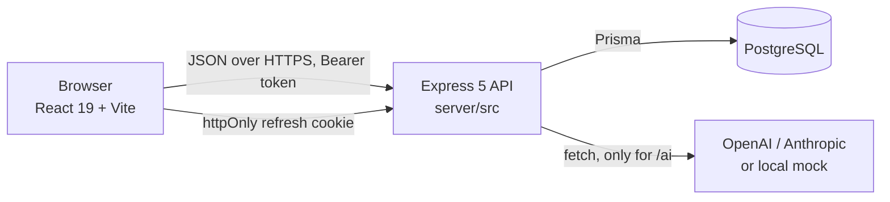
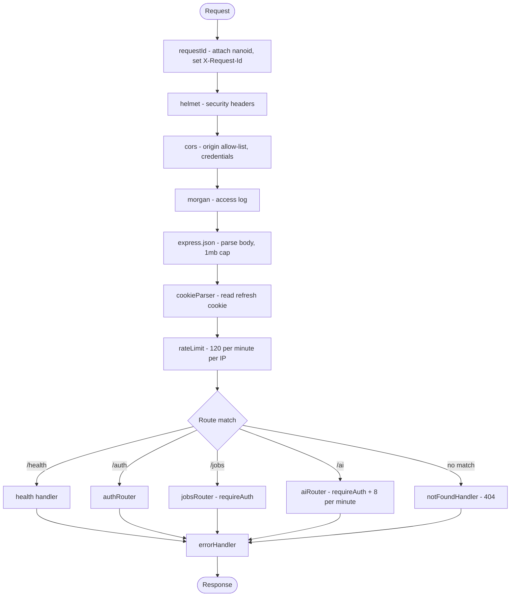
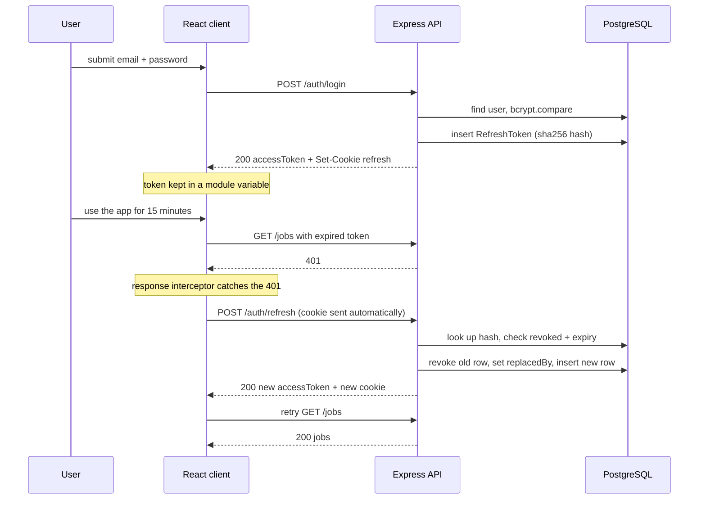
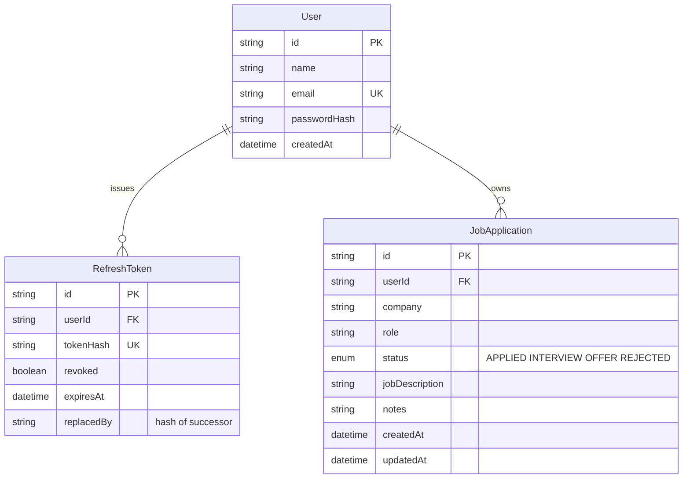
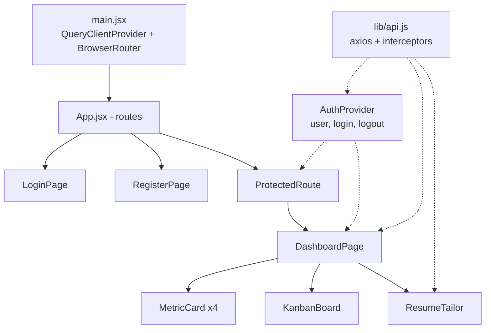

# Architecture

A React single-page app, an Express REST API, and PostgreSQL. Two npm workspaces, `client/` and `server/`, both plain JavaScript with ES modules.

## System overview



The client never talks to the database or the AI provider. Everything goes through the API, which is where auth, validation, sanitizing and rate limiting live.

Every response uses one envelope, so the client has exactly one shape to handle:

```json
{ "success": true,  "data": { }, "meta": { } }
{ "success": false, "error": { "code": "…", "message": "…" } }
```

## The middleware chain

`server/src/app.js` builds the stack in this order. Order is the whole point of the file.



Why this order:

- **requestId first**, so every log line and every error response can be tied to the same id — including one rejected by CORS. It was originally third, which meant a blocked origin logged `[undefined]` and could not be traced.
- **helmet early** so security headers are set even on responses that never reach a route, including errors.
- **CORS before anything that reads the body**, so a disallowed origin is rejected before the server does any work. The origin callback rejects with an `ApiError(403)` rather than a bare `Error`, so a blocked origin gets a clean `CORS_ORIGIN_NOT_ALLOWED` response instead of falling through to the generic 500 handler.
- **Body parsing before the rate limiter** would be wrong, but note the limiter sits after `express.json`. That is a deliberate trade-off: the 1mb cap already bounds the parsing cost, and putting the limiter last means the limit applies to real API traffic rather than to preflight requests.
- **`errorHandler` last, with four arguments.** Express only treats a middleware as an error handler if it declares `(err, req, res, next)`. Registering it before the routes would mean it never sees their errors.

### How errors become responses

Handlers throw; they never format an error response themselves. `errorHandler` in `server/src/middleware/index.js` maps three cases:

| Thrown | Becomes |
|---|---|
| `ZodError` | 400 `VALIDATION_ERROR`, with `err.issues` as details |
| `ApiError` | its own `statusCode` and `code` |
| anything else | 500 `INTERNAL_SERVER_ERROR`, logged with the request id |

The last row matters: an unexpected error never leaks a stack trace or a database message to the client. The detail goes to the log, the client gets a generic message.

## Authentication

Two tokens with different lifetimes and different storage, because they have different threat models.

| | Access token | Refresh token |
|---|---|---|
| Lifetime | 15 minutes | 7 days |
| Sent as | `Authorization: Bearer` header | `httpOnly` cookie, path `/auth` |
| Stored | module variable in the browser | the cookie, plus a hashed row in `RefreshToken` |
| Readable by JS | yes, but only in memory | no |
| Revocable | no, it just expires | yes, set `revoked` on the row |

A JWT cannot be un-issued, which is why the access token is short-lived. The refresh token is long-lived, so it is backed by a database row that can be revoked.

Only the SHA-256 hash of the refresh token is stored. A database leak does not hand an attacker usable tokens, the same reasoning as password hashing.

### Login, expiry, and silent refresh



### Refresh rotation

Every refresh issues a new token and retires the old row, recording `replacedBy` as the hash of its successor. That builds a chain.

The point is detecting theft. If an attacker steals a refresh token and uses it, the legitimate user's next refresh presents a token that is already `revoked`, and the request is rejected. Someone gets logged out, and the chain in the database shows the fork. Without rotation, a stolen refresh token is valid silently for seven days.

Each refresh token carries a random `jti` claim. That is not decoration: JWT's `iat` is measured in whole seconds, so without a unique claim two refreshes for the same user inside one second serialize to the identical string, hash to the identical value, and collide on the unique index over `tokenHash`. That surfaced as a 500 on rapid reloads before the `jti` was added.

Being honest about the gap: the code detects and rejects reuse, but nothing alerts on it or cascades a revoke of the whole family. That is the next thing to build.

### The single-flight refresh queue

`client/src/lib/api.js` has the subtle part. The dashboard fires several requests at once, so when the access token expires, several 401s arrive together. Without coordination each one would trigger its own refresh, and because rotation revokes the previous token, all but one would fail and log the user out.

```mermaid
flowchart TD
    err["401 received"] --> retry{"already retried?"}
    retry -->|yes| fail["throw, avoid an infinite loop"]
    retry -->|no| busy{"refresh in flight?"}
    busy -->|yes| wait["push to queue, await"] --> replay["retry original request"]
    busy -->|no| lead["set refreshing = true"]
    lead --> call["POST /auth/refresh"]
    call -->|ok| ok["store token, resolve queue"] --> replay
    call -->|fails| dead["reject queue, clear token,<br/>dispatch auth:session-expired"]
```

The first 401 becomes the leader and performs the refresh; the rest wait on a promise queue and replay once it resolves. The `_retry` flag on the request config prevents a request from bouncing between 401 and refresh forever.

On failure the module dispatches a browser `auth:session-expired` event. `AuthProvider` listens for it and clears the user. That event exists to avoid a circular import: `api.js` cannot import the provider that imports it.

### The boot-time refresh, and one race it creates

Because the access token lives in memory, a page reload starts with nothing. `AuthProvider` handles that by calling `/auth/refresh` before `/auth/me`: if the httpOnly cookie is still valid the session resumes silently, and if it isn't, the app falls through to the login screen.

That creates a race worth knowing about. The user lands on `/login` while the silent refresh is still in flight, signs in, and the session is established. Then the refresh finally rejects, and its `catch` clears the token and the user — undoing a login that just succeeded.

The fix is a `supersededRef` that `login`, `register` and `logout` all set. Every `await` boundary in the bootstrap checks it before touching state, so a result that was already overtaken by user action is discarded instead of applied. It is the same idea as `cancelQueries` in the optimistic update: an in-flight response that lands late must not overwrite newer truth.

## Data model



Both children cascade on user delete. Indexes are on `RefreshToken.userId`, `JobApplication(userId, status)` and `JobApplication.createdAt`, which match the three ways the app actually queries: tokens for a user, the filtered board, and date-range filtering.

### Ownership

Every job route runs `requireAuth`, then filters by `req.user.sub`. `buildJobWhere` always includes `userId`, so a list query cannot return someone else's rows. For single-row routes, `loadOwnedJob` fetches by id and compares the owner.

A job that exists but belongs to someone else returns **404, not 403**. A 403 would confirm the id is real, which leaks the existence of other users' records. 404 makes "does not exist" and "not yours" indistinguishable.

## Frontend structure



Two kinds of state, kept separate:

- **Server state** lives in TanStack Query. Jobs and metrics are queries keyed by their filters, so changing a filter refetches automatically. Any mutation invalidates `["jobs"]` and `["metrics"]`.
- **UI state** lives in `useState`: which tab is open, the contents of the add-job form, the current page.

Auth is the exception. It sits in React context because it is genuinely global and needs to be readable by `ProtectedRoute` during the first render.

### Optimistic updates

Dragging a card calls `patchJob`, which uses the `onMutate` / `onError` pair in `DashboardPage.jsx`:

1. `onMutate` cancels in-flight job queries, snapshots the current cache, and writes the new status immediately so the card moves under the cursor.
2. If the request fails, `onError` restores every snapshotted cache entry and the card snaps back.
3. `onSuccess` invalidates, so the server's version wins.

Cancelling first is the part people miss. Without `cancelQueries`, a response that was already in flight can land after the optimistic write and overwrite it with stale data.

## Testing

30 tests across 9 files, all Vitest.

- **Server**, `supertest` against the Express app with Prisma replaced by an in-memory fake in `server/src/test/prismaMock.js`. The tests exercise real routing, real middleware, real validation and real JWTs, with only the database swapped out. No Postgres needed to run them.
- **Client**, Testing Library in jsdom with `lib/api` mocked, driving the UI through `data-testid` hooks.
- `AI_PROVIDER` is `mock` and both API keys are blank in `server/src/test/setupEnv.js`, so the suite never makes a network call.

## Configuration

`server/src/config/env.js` parses `process.env` through a Zod schema at import time. A missing `DATABASE_URL` or a `JWT_ACCESS_SECRET` under 32 characters crashes the process on boot with a readable message, instead of surfacing as a confusing 500 on the first login attempt hours later.

Everywhere else imports the parsed `env` object, so no module reads `process.env` directly.
